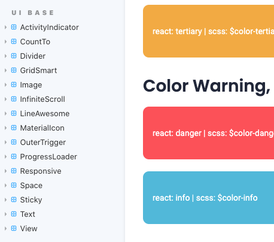
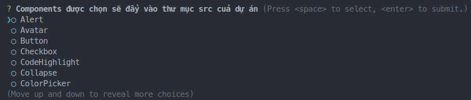

[1]: ./start.md
[3]: ./customize-theme.md

<!-- contend -->

# UI Base + CLI trong wiloke-react-core

## UI Base

UI Base là các components có sẵn chỉ cần import trong [wiloke-react-core](https://www.npmjs.com/package/wiloke-react-core)

Trước hết ta cần gõ lệnh `yarn stories-eject` để eject storybook cho UI Base ( Sau khi thực hiện xong hãy kiểm tra thư mục src/stories của dự án hoặc thực hiện lệnh `yarn storybook` để mở storybook )



#### Ví dụ như sau

```tsx
import { View, Image } from 'wiloke-react-core';

const App = () => {
  return (
    <View>
      <Image src="example.jpg">
    </View>
  )
}
```

## Components Eject

Ngoài UI Base ra thì ta còn có thể sử dụng lệnh `yarn ce` để eject components có sẵn và nó sẽ xuất hiện trong thư mục components của dự án ( những components này sẽ xuất hiện trong dự án giúp ta có thể custom lại style cũng như code logic nếu cần )

Nếu bạn mở file package.json sẽ thấy dòng này `"ce": "components-eject src",`

#### Để chạy CLI

```shell
  yarn ce
```

Và sau đó terminal xuất hiện như sau:


## Generators

Cho phép bạn tự động tạo mã soạn sẵn cho các phần chung của ứng dụng, cụ thể là các components và containers. Xem thêm tại [https://github.com/wiloke1/rc-generate](https://github.com/wiloke1/rc-generate)

### Easy use with npx

```Shell
  npx rc-generate --style scss --redux saga --component:name components/Buttons
```

### Or use with npm global

```Shell
  rc-generate --style scss --redux saga --component:name components/Button
```

<!-- end of contend -->

[Prev][1] | [Next][3]
