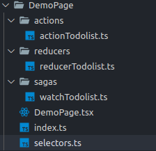

[9]: ./routing.md

<!-- content -->

# Reselect

Tạo selector trong container page



Nhận redux state trả về data

```JSX
  export const todolistSelector = (state: AppState) => state.todolist;
```

<!-- end of content -->

[Prev][9] | [Xem thêm UI tại đây](https://5f5b43872be3560022d03ffc-cmcaewwvid.chromatic.com/?path=/story/*)
